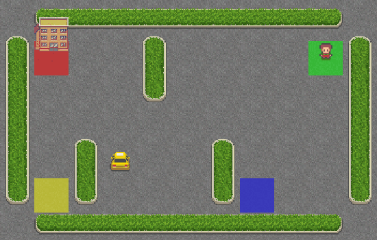
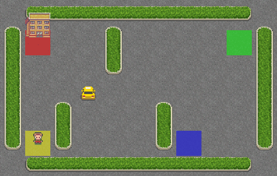
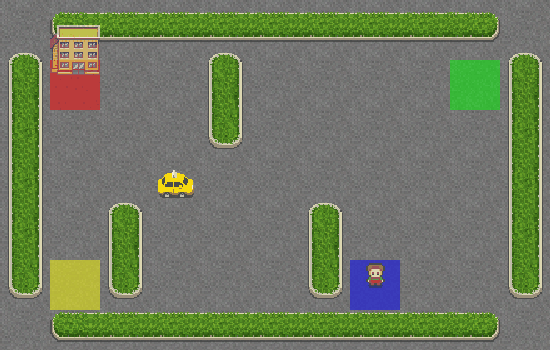

# Data Science: машинное обучение и нейронные сети (Pro Edition)

Решения домашней работы по курсам **"Data Science: машинное обучение и нейронные сети. Профессиональный уровень"**.

Используется **Python 3.12.6**.

## Содержание:

1. **Домашняя Работа №1**
* *5.	Используйте набор данных о рецептах блюд (например, набор данных Recipe Ingredients) и создайте модель классификации, которая будет предсказывать тип кухни по перечню ингредиентов.* 
**Датасет:** [Recipe Ingredients](https://www.kaggle.com/datasets/kaggle/recipe-ingredients-dataset/) 
**Решение:** [HW1_1](src/HW1_1/HW1_1.ipynb)

* *11.	Решите задачу регрессии на наборе данных о расходе электроэнергии в домах и предскажите будущий расход энергии.* 
**Датасет:** [Household Electric Power Consumption](https://www.kaggle.com/datasets/uciml/electric-power-consumption-data-set) 
**Решение:** [HW1_2](src/HW1_2/HW1_2.ipynb)

2. **Домашняя Работа №2** 
*Сверточный автоэнкодер для сжатия и восстановления изображений: Разработка сверточного автоэнкодера, способного эффективно сжимать изображения и восстанавливать их с минимальными потерями качества. Провести анализ на изображениях.* 
**Решение:** [HW2](src/HW2/HW2.ipynb)

3. **Домашняя Работа №3** 
*Написать чат-бота по примеру из лекции: https://github.com/patrickloeber/pytorch-chatbot.* 
    - Список намерений составить самостоятельно;
    - Выбрать тип нейронной сети для обучения;
    - Добавить логирование хода обучения сети;
    - Добавить логирование вопросов/ответов.
    
    **Решение:** [HW3](src/HW3/HW3.ipynb)
4. **Домашняя Работа №4** 
*Реализовать GAN на выбор: https://github.com/eriklindernoren/PyTorch-GAN* 
**Решение:** [HW4](src/HW4/HW4.ipynb)  
Использовался *Wasserstein GAN* c *Gradient Penalty*. 
Сеть обучается на наборе данных *MNIST*.  
Динамика обучения модели *WGAN-GP* выглядит стабильной, на что указывает потеря дискриминатора, сохраняющая отрицательные значения с умеренными колебаниями, и потеря генератора, демонстрирующая постепенную сходимость. Эти тенденции говорят о том, что генератор обучается эффективно, в то время как дискриминатор сохраняет свою способность отличать реальные образцы от поддельных, что отражает здоровое состязательное обучение.  
Обучение модели шло до 709 эпохи, остановилось по причине отвала Гугл Колаб'а.  
**Результат:** 
 
5. **Домашняя Работа №5** 
*Обучить агента при помощи методов, рассмотренных на лекции* 
**Решение:** [HW5](src/HW5/HW5.ipynb)  
Для тренировки агента использовался метод *Q-Learning*. Среда *Taxi v3* из *Toy Text*.  
**Результаты:** 
*Эпизод 1:* 
 
*Эпизод 2:* 
 
*Эпизод 3:* 
