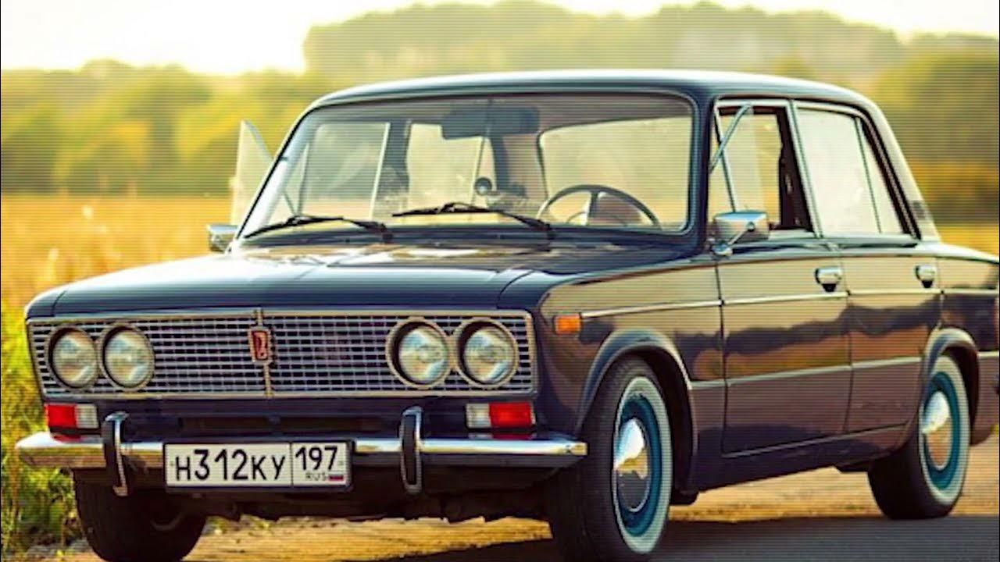
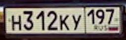

# Финальный проект

Бот, который обнаруживает автомобильные номера на фотографии.

Для обнаружения используется **YOLOv5**.

[Ссылка на Telegram бот](https://t.me/bh_hw6_bot)

# Мотивация:

Может быть полезен для фиксации нарушений, контроля доступа и др.

# Процесс:

Пользователь отправляет фотографию вида:



Ответ бота:

<br>
Уверенность: 0.8006

# Установка и запуск:

**Клонировать YOLOv5:**

```git clone https://github.com/ultralytics/yolov5.git```

**Установить зависимости:**

```pip install -r requirements.txt```

**Создать файл .env с таким содержимым:**

```BOT_TOKEN="токен полученный в @BotFather"```

**Запустить бота:**

```.venv/Scripts/python.exe app.py```